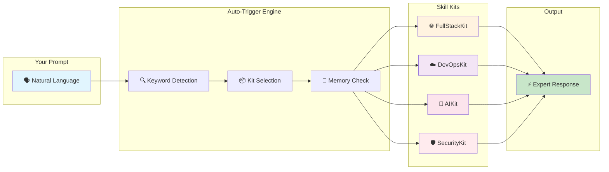
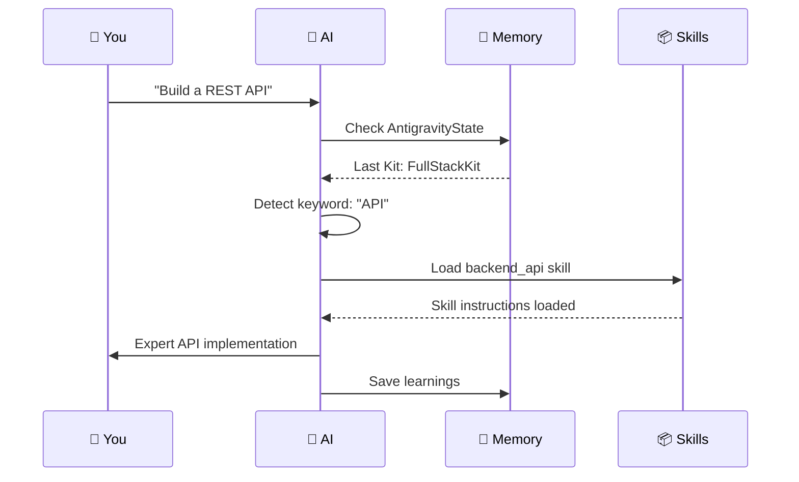

<div align="center">

# 🚀 Antigravity Agentic Skills v6.0

### The Operating System for AI Coding Agents

[](./README.tr.md)
[](LICENSE)
[]()
[]()

<br/>

> **"If it's not written, it doesn't exist."** — *The Anti-Phantom Rule*

<br/>

**Transform your AI assistant into a specialized expert with 138+ skills, automatic context switching, and persistent memory.**

[Get Started](#-quick-start) • [Features](#-key-features) • [Skills](#-skills-library) • [Installation](#-installation)

</div>

---

## 🎯 What is Antigravity?

Antigravity is a **plug-and-play skill system** that supercharges your AI coding assistant. Instead of generic responses, your AI becomes a specialized expert that:

- 🧠 **Remembers context** across sessions with MCP Memory
- 🎯 **Auto-selects the right tools** based on your prompt
- 📚 **Loads specialized knowledge** for React, AWS, Security, and more
- ⚡ **Works instantly** - just prompt naturally, no commands needed

---

## ✨ Key Features

<table>
<tr>
<td width="50%">

### 🚀 Zero-Config Auto-Trigger

No initialization commands. No manual setup. Just start prompting.

```
You: "Create a React dashboard"

AI automatically:
✅ Detects "react" keyword
✅ Loads FullStackKit
✅ Activates react_expert skill
✅ Starts building
```

</td>
<td width="50%">

### 🧠 Persistent Memory

Your AI remembers decisions, preferences, and learnings across sessions.

```
Session 1: "Always use TypeScript"
Session 2: AI remembers and applies it

✅ Cross-session context
✅ Project-specific memory
✅ Learning from mistakes
```

</td>
</tr>
<tr>
<td width="50%">

### 📦 Smart Kit Selection

Automatic skill loading based on task context.

| You Say | AI Loads |
|---------|----------|
| "React component" | FullStackKit |
| "Docker deploy" | DevOpsKit |
| "Fix security bug" | SecurityKit |
| "Write prompt" | AIKit |

</td>
<td width="50%">

### 🌐 138+ Specialized Skills

Deep expertise in every major technology.

- **Frontend:** React, Vue, CSS, Tailwind
- **Backend:** Python, Node, APIs, Databases
- **DevOps:** AWS, Docker, Kubernetes, Terraform
- **AI/ML:** Prompt Engineering, RAG, LangChain

</td>
</tr>
</table>

---

## 🏗️ Architecture



---

## 📦 Skills Library

<table>
<tr>
<td align="center" width="20%">

### 🌐 FullStackKit
**Web & Mobile**

`react_expert`
`backend_api`
`database_design`
`typescript_advanced`
`python_pro`

</td>
<td align="center" width="20%">

### ☁️ DevOpsKit
**Infrastructure**

`aws_architect`
`docker_optimization`
`kubernetes_specialist`
`terraform_engineer`
`deploy_cicd`

</td>
<td align="center" width="20%">

### 🤖 AIKit
**LLM & Agents**

`prompt_engineering`
`rag_architecture`
`agent_orchestration`
`langchain_patterns`
`context_engineering`

</td>
<td align="center" width="20%">

### 🛡️ SecurityKit
**Audits & Auth**

`secops_core`
`auth_patterns`
`compliance_analyst`
`better_auth`

</td>
<td align="center" width="20%">

### 📋 ManagementKit
**Planning**

`project_management`
`scrum_master`
`docs_readme`
`roadmap_planner`

</td>
</tr>
</table>

---

## ⚡ Quick Start

### 1️⃣ Clone the Repository

```bash
git clone https://github.com/vuralserhat86/antigravity-agentic-skills.git
```

### 2️⃣ Copy Skills to Your System

```bash
# Windows
copy skills\ %USERPROFILE%\.skillport\skills\

# macOS/Linux
cp -r skills/ ~/.skillport/skills/
```

### 3️⃣ Add GEMINI.md to Your AI's Rules

Copy `rules/GEMINI.md` content to your AI assistant's global rules.

### 4️⃣ Start Prompting! 🎉

```
"Create a React dashboard with authentication"
```

That's it! No initialization needed. The system auto-triggers.

---

## 🔄 How It Works



---

## 🌟 Why Antigravity?

| Without Antigravity | With Antigravity |
|---------------------|------------------|
| ❌ Generic AI responses | ✅ Expert-level code |
| ❌ Forgets context each session | ✅ Persistent memory |
| ❌ Manual skill specification | ✅ Auto-detection |
| ❌ One-size-fits-all | ✅ 138+ specialized skills |
| ❌ "Initialize system..." | ✅ Just prompt naturally |

---

## 📜 License

MIT License - see [LICENSE](LICENSE) for details.

---

<div align="center">

**Built with ❤️ for the Agentic AI Community**

[⬆ Back to Top](#-antigravity-agentic-skills-v60)

</div>
