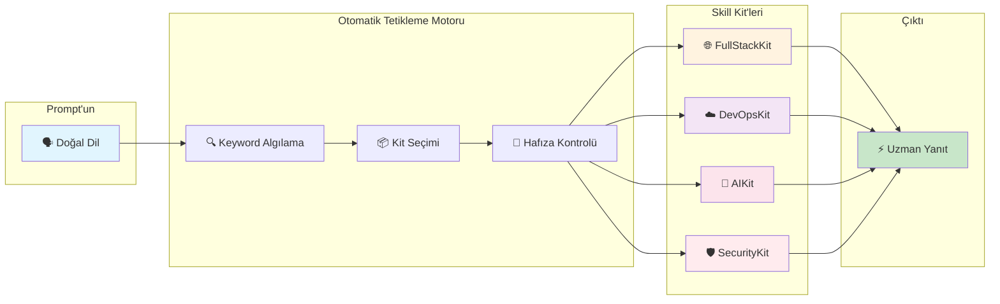
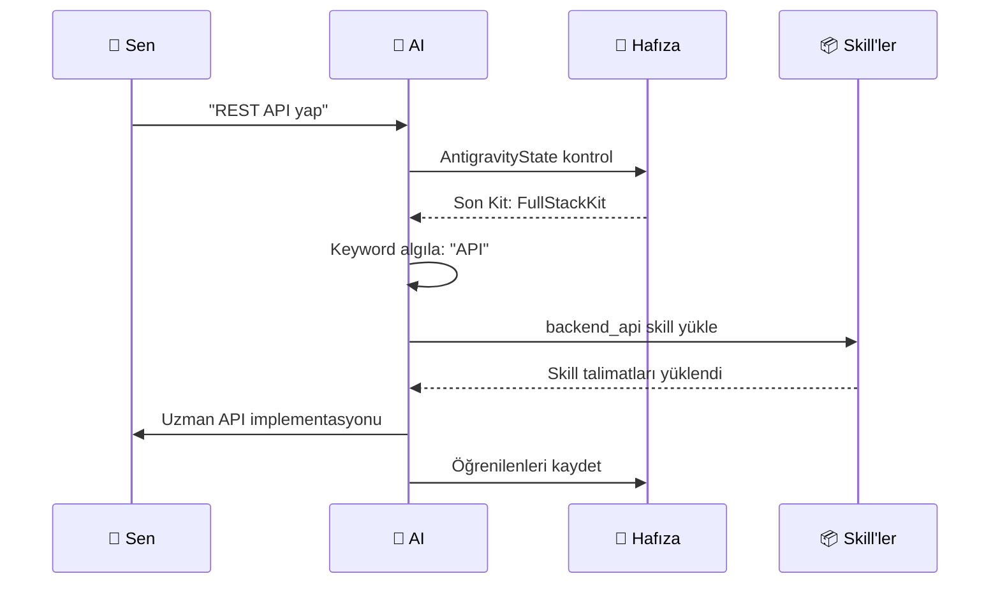

<div align="center">

# 🚀 Antigravity Agentic Skills v6.0

### Yapay Zeka Kodlama Ajanları İçin İşletim Sistemi

[](./README.md)
[](LICENSE)
[]()
[]()

<br/>

> **"Yazılı değilse, yoktur."** — *The Anti-Phantom Rule*

<br/>

**138+ skill, otomatik bağlam değiştirme ve kalıcı hafıza ile AI asistanınızı uzmanlaştırılmış bir kodlama ortağına dönüştürün.**

[Başla](#-hızlı-başlangıç) • [Özellikler](#-temel-özellikler) • [Skill'ler](#-skill-kütüphanesi) • [Kurulum](#-kurulum)

</div>

---

## 🎯 Antigravity Nedir?

Antigravity, AI kodlama asistanınızı **süper güçlü yapan tak-çalıştır bir skill sistemidir**. Genel cevaplar yerine, AI'ınız uzmanlaşmış bir ortağa dönüşür:

- 🧠 **Oturumlar arası bağlamı hatırlar** - MCP Memory ile
- 🎯 **Doğru araçları otomatik seçer** - Prompt'a göre
- 📚 **Uzmanlık bilgisi yükler** - React, AWS, Security ve daha fazlası
- ⚡ **Anında çalışır** - Sadece prompt yaz, komut yok

---

## ✨ Temel Özellikler

<table>
<tr>
<td width="50%">

### 🚀 Sıfır Konfigürasyon

Başlatma komutu yok. Manuel kurulum yok. Sadece prompt yaz.

```
Sen: "React dashboard oluştur"

AI otomatik olarak:
✅ "react" kelimesini algılar
✅ FullStackKit yükler
✅ react_expert skill aktif
✅ İnşa başlar
```

</td>
<td width="50%">

### 🧠 Kalıcı Hafıza

AI, kararları, tercihleri ve öğrenilenleri oturumlar arası hatırlar.

```
Oturum 1: "Her zaman TypeScript kullan"
Oturum 2: AI hatırlar ve uygular

✅ Oturumlar arası bağlam
✅ Projeye özel hafıza
✅ Hatalardan öğrenme
```

</td>
</tr>
<tr>
<td width="50%">

### 📦 Akıllı Kit Seçimi

Görev bağlamına göre otomatik skill yükleme.

| Sen Söylersin | AI Yükler |
|--------------|----------|
| "React component" | FullStackKit |
| "Docker deploy" | DevOpsKit |
| "Güvenlik açığı" | SecurityKit |
| "Prompt yaz" | AIKit |

</td>
<td width="50%">

### 🌐 138+ Uzmanlaşmış Skill

Her büyük teknolojide derin uzmanlık.

- **Frontend:** React, Vue, CSS, Tailwind
- **Backend:** Python, Node, APIs, Databases
- **DevOps:** AWS, Docker, Kubernetes, Terraform
- **AI/ML:** Prompt Engineering, RAG, LangChain

</td>
</tr>
</table>

---

## 🏗️ Mimari



---

## 📦 Skill Kütüphanesi

<table>
<tr>
<td align="center" width="20%">

### 🌐 FullStackKit
**Web & Mobil**

`react_expert`
`backend_api`
`database_design`
`typescript_advanced`
`python_pro`

</td>
<td align="center" width="20%">

### ☁️ DevOpsKit
**Altyapı**

`aws_architect`
`docker_optimization`
`kubernetes_specialist`
`terraform_engineer`
`deploy_cicd`

</td>
<td align="center" width="20%">

### 🤖 AIKit
**LLM & Ajanlar**

`prompt_engineering`
`rag_architecture`
`agent_orchestration`
`langchain_patterns`
`context_engineering`

</td>
<td align="center" width="20%">

### 🛡️ SecurityKit
**Denetim & Auth**

`secops_core`
`auth_patterns`
`compliance_analyst`
`better_auth`

</td>
<td align="center" width="20%">

### 📋 ManagementKit
**Planlama**

`project_management`
`scrum_master`
`docs_readme`
`roadmap_planner`

</td>
</tr>
</table>

---

## ⚡ Hızlı Başlangıç

### 1️⃣ Repoyu Klonla

```bash
git clone https://github.com/vuralserhat86/antigravity-agentic-skills.git
```

### 2️⃣ Skill'leri Sistemine Kopyala

```bash
# Windows
copy skills\ %USERPROFILE%\.skillport\skills\

# macOS/Linux
cp -r skills/ ~/.skillport/skills/
```

### 3️⃣ GEMINI.md'yi AI Kurallarına Ekle

`rules/GEMINI.md` içeriğini AI asistanının global kurallarına kopyala.

### 4️⃣ Prompt Yazmaya Başla! 🎉

```
"Kimlik doğrulaması olan bir React dashboard oluştur"
```

Bu kadar! Başlatma komutu gerekmiyor. Sistem otomatik tetiklenir.

---

## 🔄 Nasıl Çalışır?



---

## 🌟 Neden Antigravity?

| Antigravity Olmadan | Antigravity İle |
|---------------------|------------------|
| ❌ Genel AI cevapları | ✅ Uzman seviyesi kod |
| ❌ Her oturumda unutur | ✅ Kalıcı hafıza |
| ❌ Manuel skill belirtme | ✅ Otomatik algılama |
| ❌ Herkese aynı | ✅ 138+ uzmanlaşmış skill |
| ❌ "Sistemi başlat..." | ✅ Sadece doğal prompt |

---

## 📜 Lisans

MIT Lisansı - detaylar için [LICENSE](LICENSE) dosyasına bakın.

---

<div align="center">

**Agentic AI Topluluğu için ❤️ ile yapıldı**

[⬆ Başa Dön](#-antigravity-agentic-skills-v60)

</div>
